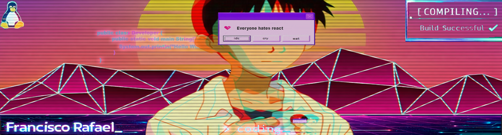
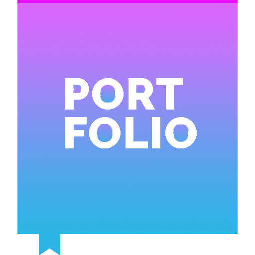

-----

-----

<table>
<tr>
 <td align="center" colspan="11"></td>
</tr> 
<tr>
<!--<td>-->
<td>
</td>
<td>
</td>
<td>
</td>
<td>
</td>
<td>
</td>
<td>
</td>
<td>
</td>
</tr>
<tr>
 <td align="center" colspan="11"></td>
</tr> 
</table>

<i><b>Olá</b> :wave:, sou o <code>Francisco</code>, tenho 20 anos, moro em BH e sou programador desde os 14 anos de idade. Atualmente estou <code>cursando</code> Engenharia de Software e sou <code>estagiário</code> na Secretaria de Tecnologia da Informação de Contagem <a href="https://portal.contagem.mg.gov.br/portal/secretarias/1/secretaria-municipal-de-tecnologia-da-informacao/" target="_blank">Prefeitura de Contagem</a>.</i> :man_teacher: Confira meu portfólio: <a href="https://portfolio-cisco.vercel.app/">portfolio-cisco</a>

-----

 
&nbsp;

<table align="center">
<tr>
<td>

</td>
<td>

</td>
</tr>
</table>
 
&nbsp;
&nbsp;

-----

 Sobre mim:

<table>
<tr>
 <td align="center" colspan="2"></td>
</tr> 
<tr>
<td width="500px" >

 
- :office: Atualmente faço <code>estágio</code> na Prefeitura de Contagem 
- :mortar_board: Estudo <code>Engenharia de Software</code> na <a href="https://www.pucminas.br/" target="_blank">PUC Minas</a> e atualmente estou no <code>4º período</code>. 
- :rocket: Estou em busca de oportunidades na área de <code>Backend</code>, com interesse em desenvolvimento de APIs e sistemas escaláveis. 
- :coffee: Sou entusiasta da linguagem <code>Java</code> e gosto de estudar boas práticas de programação e arquitetura de software. 
- :video_game: Atualmente estou aprendendo <code>desenvolvimento de jogos</code> utilizando <code>Unity</code>. 
- :art: Também gosto de <code>edição</code> e criação de conteúdo visual. 
- :books: Gosto de consumir conteúdos como  <a href="https://steamcommunity.com/profiles/76561198396789762/" target="_blank">jogos</a>, <a href="https://myanimelist.net/profile/Stunk00/" target="_blank">animes</a>, livros, séries e, filmes e NBA. 
- :tv: Meu filme favorito é <a href="https://www.imdb.com/title/tt0485947/" target="_blank">Mr. Nobody (2009)</a>. 
- :soccer: Torço para o gigante <a href="https://www.cruzeiro.com.br/" target="_blank">Cruzeiro</a>. :fox_face: 
- :speech_balloon: Pergunte-me sobre programação, tecnologia ou jogos. Adoro conversar sobre esses assuntos. 
- :mailbox: Para me encontrar, este é meu <a href="mailto:franciscocjn06@gmail.com" target="_blank">e-mail</a>. 

</td>
<td>

</td>
</tr>
<tr>
 <td align="center" colspan="2"></td>
</tr> 
</table>

-----

&nbsp;Linguagens e ferramentas:

&nbsp; 
<code></code>
&nbsp; 
<code></code>
<code></code>
&nbsp; 
<code></code>
&nbsp; 
<code></code>
&nbsp; 
<code></code>
&nbsp;
<code></code>
&nbsp;
<code></code>
&nbsp;
<code></code>
&nbsp; 
<code></code>
&nbsp; 
<code></code>
&nbsp; 
<code></code>
&nbsp; 
<code></code>
&nbsp; 
<code></code>
&nbsp; 
<code></code>
&nbsp; 
<code></code>
&nbsp; 
<code></code>
&nbsp; 
<code></code>
&nbsp;
<code></code>
&nbsp;
<code></code>
&nbsp; 
<code></code>
&nbsp; 
<code></code>
&nbsp; 
<code></code>
&nbsp; 
<code></code>
&nbsp;
<code></code>
&nbsp; 
<code></code>
&nbsp; 
<code></code>
&nbsp; 
<code></code>
&nbsp; 
<code></code>
&nbsp;
<code></code>
&nbsp;
<code></code>

-----

<table>
<tr>
 <td align="center" colspan="2">:watch: <a href="https://wakatime.com/@CiscoRafael">WakaTime</a></td>
</tr> 
<tr>
<td>

</td>

<td>

</td>
</tr>
</table>
<table>
<tr>
 <td align="center" colspan="3"></td>
</tr> 
<tr>
<td>
<!-- 
 -->

</td>
<td>

</td>
<td>

</td>
</tr>
<tr>
 <td align="center" colspan="3"></td>
</tr> 
<tr>
<td>

</td>
<td>

</td>
<td>

</td>
</tr>
<tr>
 <td align="center" colspan="3"></td>
</tr>
</table>

<table>
<tr>
 <td align="center"></td>
</tr>
<tr>
 <td align="center"></td>
</tr>
<tr>
 <td align="center"></td>
</tr> 
</table>

-----

